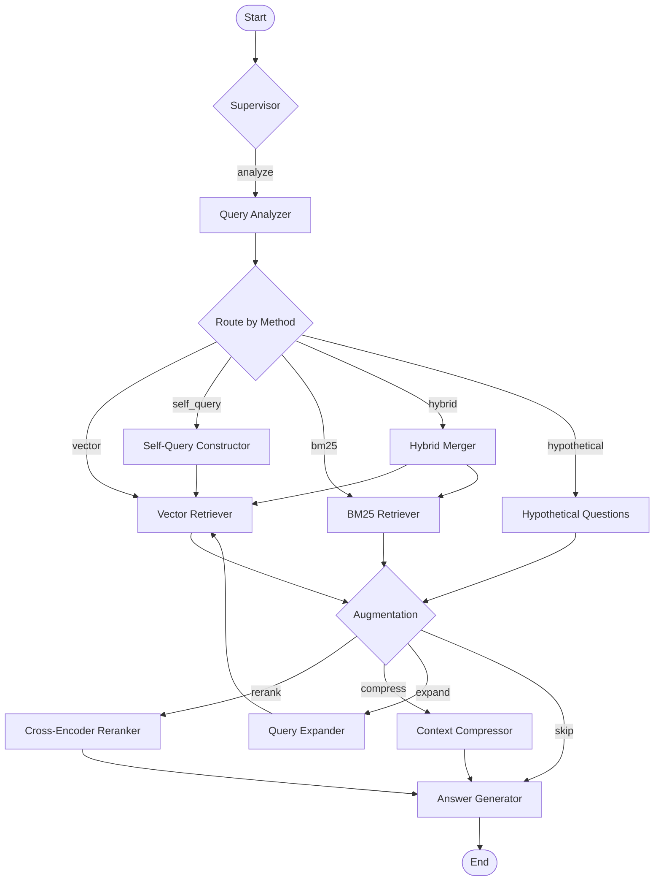

# AI Self-Querying Retriever

A professional-grade, multi-agent AI retrieval system built with LangGraph, LangChain, Django, Node.js, and React/TypeScript. Features advanced RAG (Retrieval-Augmented Generation) techniques including self-querying retrieval, hybrid search, cross-encoder reranking, context compression, and query expansion.

## Architecture Overview

```
┌─────────────────────────────────────────────────────────────────┐
│                    Frontend (React/TypeScript)                   │
│                    http://172.168.1.95:3083                      │
└───────────────────────────┬─────────────────────────────────────┘
                            │
┌───────────────────────────▼─────────────────────────────────────┐
│                  API Gateway (Node.js/TypeScript)                │
│                       Port 3084                                  │
│              WebSocket + REST + Rate Limiting                    │
└──────┬────────────────────┬──────────────────────┬──────────────┘
       │                    │                      │
┌──────▼──────┐  ┌──────────▼──────────┐  ┌───────▼───────┐
│   Django    │  │   MCP Server        │  │   LangFuse    │
│   Backend   │  │   (Port 3086)       │  │   (Port 3085) │
│  (Port 8083)│  │   Model Context     │  │  Observability│
│             │  │   Protocol          │  │               │
└──┬──┬──┬────┘  └─────────────────────┘  └───────────────┘
   │  │  │
   │  │  └──────────────────────────────────────────┐
   │  │                                             │
┌──▼──┘──────┐  ┌─────────────┐  ┌──────────────────▼──┐
│ PostgreSQL │  │    Redis    │  │     ChromaDB        │
│ (Port 5483)│  │ (Port 6383) │  │   (Port 8583)       │
│            │  │ Cache/Queue │  │   Vector Store       │
└────────────┘  └─────────────┘  └─────────────────────┘
```

## Key Features

### Retrieval Methods (from Notebook)
- **Vector Search** - Semantic similarity search using OpenAI embeddings + ChromaDB
- **Self-Querying Retriever** - LLM-constructed metadata filters from natural language
- **BM25 Keyword Search** - Traditional keyword-based retrieval using BM25 algorithm
- **Hybrid Search** - Ensemble of BM25 + vector search with configurable weights
- **Hypothetical Question Retrieval** - Generate hypothetical questions for improved matching

### Augmentation Techniques (from Notebook)
- **Cross-Encoder Reranking** - Re-score results using ms-marco-MiniLM-L-6-v2
- **Context Compression** - LLM-based extraction to filter irrelevant content
- **Query Expansion** - Enhance queries with synonyms and alternative phrasings

### Multi-Agent System (LangGraph)
- **Supervisor Agent** - Orchestrates the retrieval pipeline
- **Query Analyzer** - Determines optimal retrieval strategy
- **Self-Query Constructor** - Builds structured metadata filters
- **Vector Retriever** - Performs vector similarity search
- **BM25 Retriever** - Performs keyword-based search
- **Hybrid Merger** - Combines multi-strategy results
- **Hypothetical Question Generator** - Creates hypothetical questions
- **Reranker** - Cross-encoder reranking
- **Compressor** - Context compression
- **Query Expander** - Query enhancement
- **Answer Generator** - Final answer synthesis

### Additional Features
- **MCP (Model Context Protocol)** - Standardized tool interface for retrieval operations
- **A2A (Agent-to-Agent)** - Inter-agent communication protocol with agent cards
- **LangSmith Integration** - LLM tracing and debugging
- **LangFuse Observability** - Self-hosted LLM monitoring and analytics
- **Real-time Streaming** - WebSocket-based streaming responses
- **Analytics Dashboard** - Query trends, method comparison, performance metrics
- **Pipeline Builder** - Configure custom retrieval pipelines
- **Document Management** - Upload, organize, and manage document collections
- **Celery Task Queue** - Asynchronous document processing and indexing

## Tech Stack

| Component | Technology | Port |
|-----------|-----------|------|
| Frontend | React 18 + TypeScript + Vite + Tailwind CSS | 3083 |
| API Gateway | Node.js + Express + TypeScript | 3084 |
| Backend | Django 5 + Django REST Framework | 8083 |
| Database | PostgreSQL 16 | 5483 |
| Vector Store | ChromaDB 0.6.3 | 8583 |
| Cache/Queue | Redis 7 | 6383 |
| MCP Server | Node.js + @modelcontextprotocol/sdk | 3086 |
| Observability | LangFuse 2 (self-hosted) | 3085 |
| Task Monitor | Celery Flower | 5583 |
| LLM Framework | LangChain 0.3.21 + LangGraph | - |
| Embeddings | OpenAI text-embedding-ada-002 | - |
| LLM | OpenAI gpt-4o-mini | - |

## Quick Start

### Prerequisites
- Docker and Docker Compose
- OpenAI API key

### 1. Clone and Configure

```bash
git clone <repository-url>
cd self-querying-retriever
cp .env.example .env
# Edit .env with your API keys
```

### 2. Start All Services

```bash
docker compose up -d
```

### 3. Access the Application

| Service | URL |
|---------|-----|
| **Main Application** | http://172.168.1.95:3083 |
| API Gateway | http://172.168.1.95:3084 |
| Django Admin | http://172.168.1.95:8083/admin/ |
| LangFuse Dashboard | http://172.168.1.95:3085 |
| Celery Flower | http://172.168.1.95:5583 |
| MCP Server | http://172.168.1.95:3086 |

### 4. Seed Sample Data

The renewable energy documents from the notebook are automatically seeded on first startup. To manually seed:

```bash
docker compose exec backend python manage.py seed_documents --no-input
```

## Development

### Backend Development

```bash
cd backend
python -m venv venv
source venv/bin/activate
pip install -r requirements.txt
python manage.py migrate
python manage.py seed_documents --no-input
python manage.py runserver 0.0.0.0:8083
```

### Frontend Development

```bash
cd frontend
npm install
npm run dev
```

### API Gateway Development

```bash
cd api-gateway
npm install
npm run dev
```

## API Endpoints

### Query
- `POST /api/query/` - Submit a retrieval query
- `GET /api/query/history/` - Query history
- `POST /api/query/expand/` - Expand a query

### Documents
- `GET /api/documents/` - List documents
- `POST /api/documents/` - Upload document
- `POST /api/documents/bulk/` - Bulk upload

### Collections
- `GET /api/collections/` - List collections
- `POST /api/collections/` - Create collection

### Agents
- `GET /api/agents/` - List agent cards (A2A)
- `GET /api/agents/graph/` - LangGraph mermaid diagram
- `GET /api/agents/executions/` - Agent execution history

### Analytics
- `GET /api/analytics/dashboard/` - Dashboard statistics
- `GET /api/analytics/trends/` - Query trends
- `GET /api/analytics/methods/` - Method comparison

### MCP
- `GET /api/mcp/tools/` - List MCP tools
- `POST /api/mcp/tools/:name/` - Execute MCP tool

### A2A Discovery
- `GET /.well-known/agent.json` - A2A agent discovery

## Document Metadata Schema

Documents support the following metadata fields (from the notebook):

| Field | Type | Description | Example Values |
|-------|------|-------------|---------------|
| year | integer | Publication year | 2023, 2024, 2025 |
| topics | string | Main topic category | solar power, wind energy, biomass |
| subtopic | string | Sub-category | renewable energy, policy |

## LangGraph Agent Workflow



## Project Structure

```
self-querying-retriever/
├── docker-compose.yml          # Multi-service orchestration
├── .env.example                # Environment configuration template
├── frontend/                   # React/TypeScript SPA
│   ├── src/
│   │   ├── components/         # Reusable UI components
│   │   ├── pages/              # Page components
│   │   ├── hooks/              # Custom React hooks
│   │   ├── services/           # API and WebSocket clients
│   │   ├── store/              # Zustand state management
│   │   └── types/              # TypeScript type definitions
│   └── Dockerfile
├── api-gateway/                # Node.js API Gateway
│   ├── src/
│   │   ├── routes/             # Express routes
│   │   ├── middleware/         # Auth, rate-limit, logging
│   │   └── services/           # Proxy, WebSocket manager
│   └── Dockerfile
├── backend/                    # Django Backend
│   ├── config/                 # Django settings, URLs, ASGI/WSGI
│   ├── retriever/              # Core retrieval app
│   │   ├── agents/             # LangGraph multi-agent system
│   │   │   ├── graph.py        # StateGraph definition
│   │   │   ├── nodes.py        # Agent node implementations
│   │   │   ├── state.py        # State definitions
│   │   │   ├── tools.py        # LangGraph tools
│   │   │   ├── prompts.py      # Prompt templates
│   │   │   └── callbacks.py    # Custom callbacks
│   │   ├── services/           # Business logic
│   │   │   ├── vector_store.py # ChromaDB integration
│   │   │   ├── retrievers.py   # Retrieval implementations
│   │   │   ├── augmentation.py # Reranking, compression, expansion
│   │   │   └── observability.py# LangSmith + LangFuse
│   │   └── a2a/                # Agent-to-Agent protocol
│   ├── documents/              # Document management app
│   ├── analytics/              # Analytics app
│   └── Dockerfile
├── mcp-server/                 # Model Context Protocol server
│   ├── src/
│   │   ├── tools/              # MCP tool definitions
│   │   └── resources/          # MCP resource definitions
│   └── Dockerfile
├── scripts/                    # Database init scripts
└── notebooks/                  # Original notebook
    └── W6_Adv_RAG_Rec_NB.ipynb
```

## Environment Variables

See `.env.example` for all configuration options. Key variables:

- `OPENAI_API_KEY` - Your OpenAI API key (required)
- `LANGCHAIN_API_KEY` - LangSmith API key (optional)
- `LANGFUSE_PUBLIC_KEY` / `LANGFUSE_SECRET_KEY` - LangFuse keys (optional)
- `POSTGRES_PASSWORD` - Database password (change in production)
- `DJANGO_SECRET_KEY` - Django secret key (change in production)

## License

MIT
